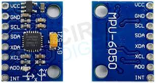

# Force Feedback Glove Prototype

## Project Overview

The Finger-Tracking Force-Feedback Glove is an innovative device aimed at enhancing the immersive experience of virtual reality (VR) by allowing users to physically interact with digital environments. This glove integrates precise finger-tracking and force-feedback technology to simulate resistance, creating a realistic and tactile virtual interaction. Its adaptable design makes it suitable for gaming, simulation, and training applications, enabling a new level of engagement in VR.

## Core Components

1. ESP32 DevKit V1: Main microcontroller
2. MPU6050: 6-axis gyroscope and accelerometer
3. SG90 Servo motor
4. Potentiometers

## Key Features

### 3D Hand Tracking

The MPU6050 sensor provides 6 degrees of freedom (6DOF) motion tracking. This allows for:
- Orientation in 3D space

### Finger Tracking

Initially focusing on a single finger:
- Potentiometers can be used for finger tracking

### Force Feedback

SG90 servo motors are the core of the force feedback system:
- Turn the arm to restrict the movement of the wheels which are attached to potentiometers
- Create a sense of resistance to the fingers when interacting with virtual objects

### Communication

The communication handles by the ESP32:
- Receives tracking data from the MPU6050 via I2C protocol
- Processes motion data and calculates required force feedback
- Controls servos to restrict the 
- Communicate with a computer via serial communication for integration with VR applications

This project is in early development stages.
